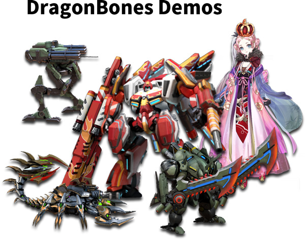
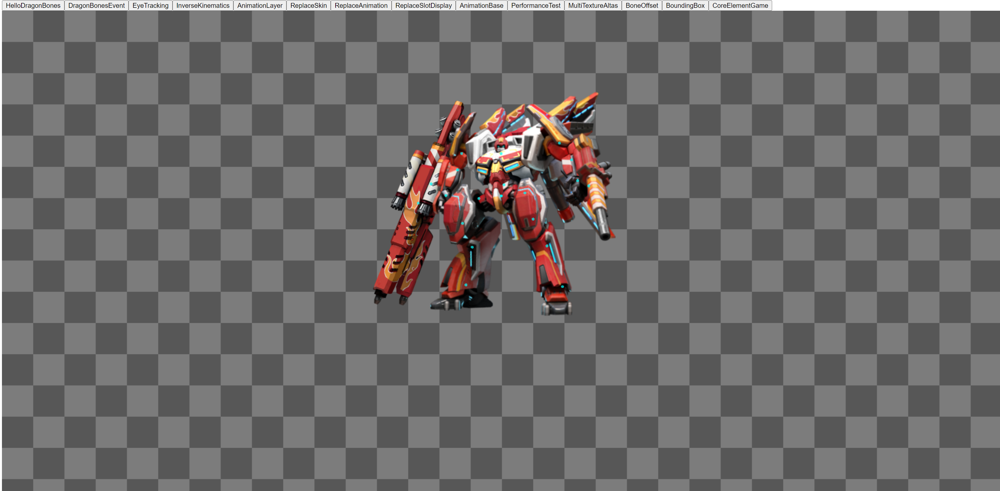

# DragonBones - Pixi V8
DragonBones runtime and Demo for Pixi V8.

## Why?
[Erget](https://egret.com) the company behind DragonBones seems like did abandoned DragonBones and its libraries from years ago.

[SGGames](https://sggame.us) Our team will upgrade it to support modern Js/Ts runtime and adding a new shiny Editor too. 

🔥🔥🔥 Stay tuned! 🔥🔥🔥

## Feature list
Same as DragonBones.js at the moment but will be added soon with more next-gen features:

✅ Modern typescript
✅ Pixi V8 with much better performance
✅ Animations
✅ Mesh
✅ IK
✅ Events
✅ Userdata
🔥...

## To use as library
```
npm install dragonbones-pixijs
```
### Example Typescript
```typescript
export default class HelloDragonBones extends BaseDemo {
    public constructor() {
        super();

        this._resources.push(
            "resource/mecha_1002_101d_show/mecha_1002_101d_show_ske.json",
            "resource/mecha_1002_101d_show/mecha_1002_101d_show_tex.json",
            "resource/mecha_1002_101d_show/mecha_1002_101d_show_tex.png"
        );
    }

    protected _onStart(): void {
        const factory = PixiFactory.factory;
        factory.parseDragonBonesData(this._pixiResources["resource/mecha_1002_101d_show/mecha_1002_101d_show_ske.json"]);

        factory.parseTextureAtlasData(
            this._pixiResources["resource/mecha_1002_101d_show/mecha_1002_101d_show_tex.json"],
            this._pixiResources["resource/mecha_1002_101d_show/mecha_1002_101d_show_tex.png"]);

        const armatureDisplay = factory.buildArmatureDisplay("mecha_1002_101d", "mecha_1002_101d_show")!;
        armatureDisplay.animation.play("idle");

        this.container.addChild(armatureDisplay);
    }
}
```

### Load data
```

```

### Add to Stage and Display


## To start development
Work with Vite

```
npm install
npm run dev
```

## To build
```
npm run build
```

## Run demo
[Examples - in surge.sh](https://dragonbones-pixi-v8-demo.surge.sh)

- Click button in the top to go through different Examples




- GithubPages.io is WIP
- CodeSandBox.io samples too


## References
Old version (PixiV4-5)

https://github.com/DragonBones/DragonBonesJS

Pixi.js

https://pixijs.com/
https://github.com/pixijs/pixijs